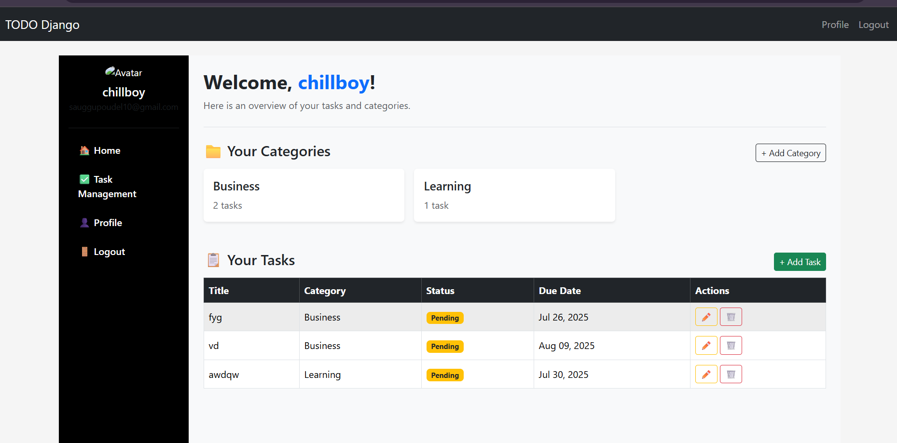

# ✅ TODO Task Manager (Django + Bootstrap 5)

A simple yet powerful task management web application built using Django.  
Users can register, log in, create and manage personal tasks categorized by custom categories. Each user has a profile with a bio and profile photo. The interface is styled using Bootstrap 5 for a modern, responsive user experience.

---

## 📊 Features

- 🔐 User Registration, Login, Logout
- 👤 User Profile with Bio & Profile Photo
- ✅ Create, Edit, Delete Tasks with Title, Description, Due Date, and Category
- ⏳ Mark Tasks as Completed or Pending
- 📂 Task Categories: Create and Manage
- 🖥 Responsive Dashboard with Sidebar Navigation
- 📝 Update Profile Info and Upload Profile Picture
- 🧩 Built-in Admin Panel
- ⚙️ Django Signals: Automatically create user profiles
- 🗃 SQLite database by default (easy to switch)
- 🎨 Clean UI using Bootstrap 5

---

## 🗂 Project Structure

```bash
todo_django/
├── manage.py
├── requirements.txt
├── db.sqlite3
├── todo/
│   ├── __init__.py
│   ├── admin.py
│   ├── apps.py
│   ├── forms.py
│   ├── models.py
│   ├── views.py
│   ├── urls.py
│   ├── templates/
│   │   ├── base.html
│   │   ├── dashboard.html
│   │   ├── add_task.html
│   │   ├── edit_task.html
│   │   ├── category/
│   │   │   └── add_category.html
│   │   └── profiles/
│   │       ├── register.html
│   │       ├── login.html
│   │       ├── profile.html
│   └── static/
│       ├── css/
│       └── js/
├── profiles/
│   ├── __init__.py
│   ├── admin.py
│   ├── apps.py
│   ├── models.py
│   ├── views.py
│   ├── forms.py
│   ├── signals.py
│   └── urls.py
```
---

## 🔧 Setup Instructions
1️⃣ Clone the Repository
```bash

git clone https://github.com/yourusername/todo-django.git
cd todo-django
```
2️⃣ Create and Activate Virtual Environment
```bash

python -m venv venv
# Windows
venv\Scripts\activate
# macOS/Linux
source venv/bin/activate
```
3️⃣ Install Dependencies
```bash

pip install -r requirements.txt
```
4️⃣ Apply Migrations
```bash

python manage.py migrate
```
5️⃣ (Optional) Create Superuser
```bash

python manage.py createsuperuser
```
6️⃣ Run Development Server
```bash

python manage.py runserver
```

7️⃣ Open in Browser
Visit: http://127.0.0.1:8000/

---

## 💡 How It Works
Tasks are stored with title, description, due_date, category, and status

Users can only view and manage their own tasks

A Profile model is linked to each user via Django’s OneToOneField

Django signals (post_save) automatically create and update profiles on user creation

All data is stored in a local SQLite database (by default)

Admin dashboard is accessible via /admin/

## 🧪 Usage Guide
📝 Register a new user account.

🔐 Log in with your credentials.

🗂 Create categories like "Work", "Study", "Personal".

🧾 Create new tasks by selecting a category and due date.

✅ Mark tasks as completed directly from the dashboard.

👤 Navigate to profile and update your bio or photo.

🔄 Log out anytime using the top-right logout link.

---

## 🎨 UI and Frontend
Bootstrap 5 is used for styling

Responsive sidebar navigation on all pages

Profile photo displayed on dashboard

Cards used for listing tasks neatly

---

## 🧰 Tech Stack
Backend: Django (Python)

Frontend: HTML5, Bootstrap 5, CSS3

Database: SQLite (default), easy to replace with PostgreSQL/MySQL

Other: Django Signals, Forms, Sessions

---

## 🖼 Screenshots (Add When Available)

    

---

## 🚀 Deployment
You can deploy this app on:

Heroku

Render

Railway

Vercel (via API only)

Any VPS (DigitalOcean, Linode, etc.)

Deployment Notes:

Set DEBUG = False in settings.py

Add domain to ALLOWED_HOSTS

Set up STATIC_ROOT and MEDIA_ROOT

Use gunicorn and Nginx in production

## 📄 License
This project is licensed under the MIT License.
Feel free to use, modify, and distribute with attribution.

---

## 🙋‍♂️ Author
Made with ❤️ by Saugat Paudel